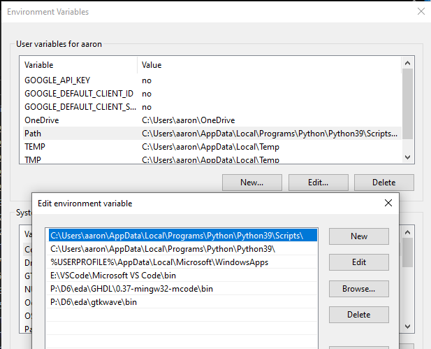
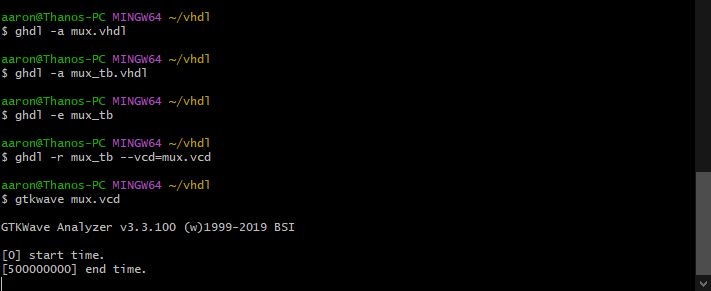
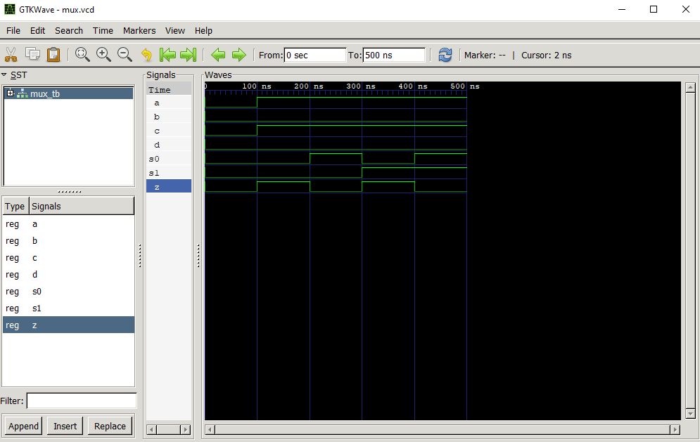

# Lab 1 - GHDL and GTKWave
---

-Started off by downloading notepadd++

Editing environment variables\

-Found it was easier to run commands in Git Bash

## Half Adder

Running vhdl command in Git Bash\

Half Adder Example\

---
## Multiplexer

Running vhdl command in Git Bash\

Multiplexer Example\

