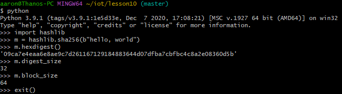
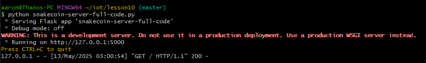

# Lab 10 - Blockchain
---

-Continued using Git Bash \
-General note: After completing all of these labs, I can say I feel much more proficient in using GitHub and I can more fully appreciate what it offers. 

Directing to lesson 10
```
$ cd ~/iot/lesson10
```

## cat hash_value.py
```
$ cat hash_value.py
"""
https://docs.python.org/3/using/cmdline.html#envvar-PYTHONHASHSEED
If PYTHONHASHSEED is not set or set to random, a random value is used to to seed the hashes of str and bytes objects.
If PYTHONHASHSEED is set to an integer value, it is used as a fixed seed for generating the hash() of the types covered by the hash randomization.
Its purpose is to allow repeatable hashing, such as for selftests for the interpreter itself, or to allow a cluster of python processes to share hash values.
The integer must be a decimal number in the range [0,4294967295]. Specifying the value 0 will disable hash randomization.

https://www.programiz.com/python-programming/methods/built-in/hash
hash(object) returns the hash value of the object (if it has one). Hash values are integers.
They are used to quickly compare dictionary keys during a dictionary lookup.
Numeric values that compare equal have the same hash value even if they are of different types, as is the case for 1 and 1.0.
For objects with custom __hash__() methods, note that hash() truncates the return value based on the bit width of the host machine.
"""

# hash for integer unchanged
print('The hash for 1 is:', hash(1))

# hash for decimal
print('The hash for 1.0 is:',hash(1.0))
print('The hash for 3.14 is:',hash(3.14))

# hash for string
print('The hash for Python is:', hash('Python'))

# hash for a tuple of vowels
vowels = ('a', 'e', 'i', 'o', 'u')
print('The hash for a tuple of vowels is:', hash(vowels))

# hash for a custom object
class Person:
    def __init__(self, age, name):
        self.age = age
        self.name = name
    def __eq__(self, other):
        return self.age == other.age and self.name == other.name
    def __hash__(self):
        return hash((self.age, self.name))
person = Person(23, 'Adam')
print('The hash for an object of person is:', hash(person))
```

## hash_value.py (attempt 1)
```
$ python hash_value.py
The hash for 1 is: 1
The hash for 1.0 is: 1
The hash for 3.14 is: 322818021289917443
The hash for Python is: -904136032779973994
The hash for a tuple of vowels is: -3159638954137705478
The hash for an object of person is: -4244123469910948321
```
## hash_value.py (attempt 2)
```
$ python hash_value.py
The hash for 1 is: 1
The hash for 1.0 is: 1
The hash for 3.14 is: 322818021289917443
The hash for Python is: 9066754906013145552
The hash for a tuple of vowels is: -1266526089569164422
The hash for an object of person is: -3266617158723837371
```

Comparison:\
-The first 3 hashes (1, 1.0, and 3.14) were all the same\
-The last 3 hashes (pytthon, tuple of vowels, object of person) were different

## Securing hash algorithm


## cat snakecoin.py
```
$ cat snakecoin.py
# Gerald Nash, "Let's build the tiniest blockchain in less than 50 lines of Python"
import hashlib as hasher
import datetime as date

# Define what a Snakecoin block is
class Block:
  def __init__(self, index, timestamp, data, previous_hash):
    self.index = index
    self.timestamp = timestamp
    self.data = data
    self.previous_hash = previous_hash
    self.hash = self.hash_block()

  def hash_block(self):
    sha = hasher.sha256()
    sha.update(str(self.index).encode() + str(self.timestamp).encode() + str(self.data).encode() + str(self.previous_hash).encode())
    return sha.hexdigest()

# Generate genesis block
def create_genesis_block():
  # Manually construct a block with
  # index zero and arbitrary previous hash
  return Block(0, date.datetime.now(), "Genesis Block", "0")

# Generate all later blocks in the blockchain
def next_block(last_block):
  this_index = last_block.index + 1
  this_timestamp = date.datetime.now()
  this_data = "Hey! I'm block " + str(this_index)
  this_hash = last_block.hash
  return Block(this_index, this_timestamp, this_data, this_hash)

# Create the blockchain and add the genesis block
blockchain = [create_genesis_block()]
previous_block = blockchain[0]

# How many blocks should we add to the chain
# after the genesis block
num_of_blocks_to_add = 20

# Add blocks to the chain
for i in range(0, num_of_blocks_to_add):
  block_to_add = next_block(previous_block)
  blockchain.append(block_to_add)
  previous_block = block_to_add
  # Tell everyone about it!
  print("Block #{} has been added to the blockchain!".format(block_to_add.index))
  print("Hash: {}\n".format(block_to_add.hash))
```

## Running snakecoin.py
```
$ python snakecoin.py
Block #1 has been added to the blockchain!
Hash: 1f15872a33ad66c1ed4ff0e801b910ae4369984ec61889cd0c7ffca88b7e184f

Block #2 has been added to the blockchain!
Hash: 8bc2821098eee260aeba93fab08963f4d8ca3f96b04b30b9ca65a229471087f7

Block #3 has been added to the blockchain!
Hash: 6c637d130c805010eb759324767ad2a177fa910d549e29afae8400d5ab15860e

Block #4 has been added to the blockchain!
Hash: f9d3982939ee0fa0e8b5156d348ed82dda0160ed3d8ad28c36844f1391297e6e

Block #5 has been added to the blockchain!
Hash: ca06eadd6d483bba89dedebe8eb7d8c922b2f836ec6a614e65fadacdd2ee237c

Block #6 has been added to the blockchain!
Hash: ea2191a04c860a1589115099e068a608709856662823aea1b05333717075f61c

Block #7 has been added to the blockchain!
Hash: 3e43c1f23ec770e22e4456756b57b5466054f66c98a99fd16953aa20c2cc4ec6

Block #8 has been added to the blockchain!
Hash: 836b2938f481aaefa37e7c3342eedd409aa7e2f2d653ebe24c7a9485cca699f9

Block #9 has been added to the blockchain!
Hash: 127885403a0bd864f8ecb3995f8a76e6bed1f5255220842d34792818e274f95f

Block #10 has been added to the blockchain!
Hash: 8eb6f9d17ebbea8295e7741f491879cfd0eaabe8fb34d0bd650b275df40d64da

Block #11 has been added to the blockchain!
Hash: e55f224fa661e8585b2199e6df9265269aeb57913a1acd3a97c37f3fadb41fd9

Block #12 has been added to the blockchain!
Hash: 65ff98f1bbe0b702c4b187056a11cf4e7d6eddfbd9040ad7361c1666eb614431

Block #13 has been added to the blockchain!
Hash: ac0dd72e6b34a806cbbc550bf613af551c691727de4d91d5fe95bc96a10a93b4

Block #14 has been added to the blockchain!
Hash: 4e8425c684890382a5f47482253ef9ff0ed77a9dd251211bcb37e02d1fa46d72

Block #15 has been added to the blockchain!
Hash: d090cfae7625d3805ef5c40be24aa8695e38b4e48a91520ed6cd031f5ac9c656

Block #16 has been added to the blockchain!
Hash: 80339e2c807b6b919fb649e293f5b982fea3f2ccc9599bff3a0f359a48ef5431

Block #17 has been added to the blockchain!
Hash: 24e02c8c111b5c45dd6adce7c29493e7c5c455eea5b2dc33c3d605e09307328d

Block #18 has been added to the blockchain!
Hash: 55dee8143d7b4f5ec9d3591730572cb7f0fd3ef9b2939ea9f8040a52f78c3d3a

Block #19 has been added to the blockchain!
Hash: 8ee5839b5799d4cf91108c22f9fa1fd524b198886eeeb233fcafa8cf2344dc2b

Block #20 has been added to the blockchain!
Hash: cca8dd164f55e520f5264f78936c0e59c405fcdc50d0ecc4a95032ebce8e1ce9
```

## Terminal 1: Running SnakeCoin server
### cat snakecoin-server-full-code.py
```
$ cat snakecoin-server-full-code.py
# Gerald Nash, "Let’s Make the Tiniest Blockchain Bigger Part 2: With More Lines of Python"
# Referred to https://www.pythonanywhere.com/forums/topic/12382/ that fixed sha.update() TypeError: Unicode-objects must be encoded before hashing
# Running on http://127.0.0.1:5000/mine (Reload the page to mine and press CTRL+C to quit)
from flask import Flask
from flask import request
import json
import requests
import hashlib as hasher
import datetime as date
from flask import send_from_directory
import os
node = Flask(__name__)

# Define what a Snakecoin block is
class Block:
  def __init__(self, index, timestamp, data, previous_hash):
    self.index = index
    self.timestamp = timestamp
    self.data = data
    self.previous_hash = previous_hash
    self.hash = self.hash_block()

  def hash_block(self):
    sha = hasher.sha256()
#    sha.update(str(self.index) + str(self.timestamp) + str(self.data) + str(self.previous_hash))
    sha.update((str(self.index) + str(self.timestamp) + str(self.data) + str(self.previous_hash)).encode("utf-8"))
    return sha.hexdigest()

# Generate genesis block
def create_genesis_block():
  # Manually construct a block with
  # index zero and arbitrary previous hash
  return Block(0, date.datetime.now(), {
    "proof-of-work": 9,
    "transactions": None
  }, "0")

# A completely random address of the owner of this node
miner_address = "q3nf394hjg-random-miner-address-34nf3i4nflkn3oi"
# This node's blockchain copy
blockchain = []
blockchain.append(create_genesis_block())
# Store the transactions that
# this node has in a list
this_nodes_transactions = []
# Store the url data of every
# other node in the network
# so that we can communicate
# with them
peer_nodes = []
# A variable to deciding if we're mining or not
mining = True

@node.route("/")
def hello():
    return "SnakeCoin Server"

@node.route('/favicon.ico')
def favicon():
    return send_from_directory(os.path.join(node.root_path, 'static'),
                               'favicon.ico',
                               mimetype='image/vnd.microsoft.icon')

@node.route('/txion', methods=['POST'])
def transaction():
  # On each new POST request,
  # we extract the transaction data
  new_txion = request.get_json()
  # Then we add the transaction to our list
  this_nodes_transactions.append(new_txion)
  # Because the transaction was successfully
  # submitted, we log it to our console
  print("New transaction")
  print(("FROM: {}".format(new_txion['from'].encode('ascii','replace'))))
  print(("TO: {}".format(new_txion['to'].encode('ascii','replace'))))
  print(("AMOUNT: {}\n".format(new_txion['amount'])))
  # Then we let the client know it worked out
  return "Transaction submission successful\n"

@node.route('/blocks', methods=['GET'])
def get_blocks():
  chain_to_send = blockchain
  # Convert our blocks into dictionaries
  # so we can send them as json objects later
  for i in range(len(chain_to_send)):
    block = chain_to_send[i]
    block_index = str(block.index)
    block_timestamp = str(block.timestamp)
    block_data = str(block.data)
    block_hash = block.hash
    chain_to_send[i] = {
      "index": block_index,
      "timestamp": block_timestamp,
      "data": block_data,
      "hash": block_hash
    }
  chain_to_send = json.dumps(chain_to_send)
  return chain_to_send

def find_new_chains():
  # Get the blockchains of every
  # other node
  other_chains = []
  for node_url in peer_nodes:
    # Get their chains using a GET request
    block = requests.get(node_url + "/blocks").content
    # Convert the JSON object to a Python dictionary
    block = json.loads(block)
    # Add it to our list
    other_chains.append(block)
  return other_chains

def consensus():
  # Get the blocks from other nodes
  other_chains = find_new_chains()
  # If our chain isn't longest,
  # then we store the longest chain
  longest_chain = blockchain
  for chain in other_chains:
    if len(longest_chain) < len(chain):
      longest_chain = chain
  # If the longest chain isn't ours,
  # then we stop mining and set
  # our chain to the longest one
  blockchain = longest_chain

def proof_of_work(last_proof):
  # Create a variable that we will use to find
  # our next proof of work
  incrementor = last_proof + 1
  # Keep incrementing the incrementor until
  # it's equal to a number divisible by 9
  # and the proof of work of the previous
  # block in the chain
  while not (incrementor % 9 == 0 and incrementor % last_proof == 0):
    incrementor += 1
  # Once that number is found,
  # we can return it as a proof
  # of our work
  return incrementor

@node.route('/mine', methods = ['GET'])
def mine():
  # Get the last proof of work
  last_block = blockchain[len(blockchain) - 1]
  last_proof = last_block.data['proof-of-work']
  # Find the proof of work for
  # the current block being mined
  # Note: The program will hang here until a new
  #       proof of work is found
  proof = proof_of_work(last_proof)
  # Once we find a valid proof of work,
  # we know we can mine a block so
  # we reward the miner by adding a transaction
  this_nodes_transactions.append(
    { "from": "network", "to": miner_address, "amount": 1 }
  )
  # Now we can gather the data needed
  # to create the new block
  new_block_data = {
    "proof-of-work": proof,
    "transactions": list(this_nodes_transactions)
  }
  new_block_index = last_block.index + 1
  new_block_timestamp = this_timestamp = date.datetime.now()
  last_block_hash = last_block.hash
  # Empty transaction list
  this_nodes_transactions[:] = []
  # Now create the
  # new block!
  mined_block = Block(
    new_block_index,
    new_block_timestamp,
    new_block_data,
    last_block_hash
  )
  blockchain.append(mined_block)
  # Let the client know we mined a block
  return json.dumps({
      "index": new_block_index,
      "timestamp": str(new_block_timestamp),
      "data": new_block_data,
      "hash": last_block_hash
  }) + "\n"

node.run()
```


```
$ python snakecoin-server-full-code.py
```
-Opened at http://127.0.0.1:5000/ \


## Terminal 2: Creating transaction and mining block
 \
-Opened at http://127.0.0.1:5000/mine \


Terminal 1 updated


## Terminal 1: node_server.py
Cloning blockchain_app


Uncommenting in node_server.py
```
$ cd ~/python_blockchain_app
$ nano node_server.py
```


Running node_server.py
```
python node_server.py
```


## Terminal 2: Running run_app.py
```
$ cd ~/python_blockchain_app
$ python run_app.py
```


-Opened at http://127.0.0.1:5000/ \
 \
Posting \
 \
-Request to Mine and opened at http://127.0.0.1:8000/mine \
 \
Recycle \

