# Lab 2 - Command Line
---

-Used Git Bash as with Lab 1

## hostname
Gives name of device\
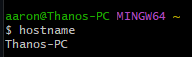

## env
Gives environment variables of device\
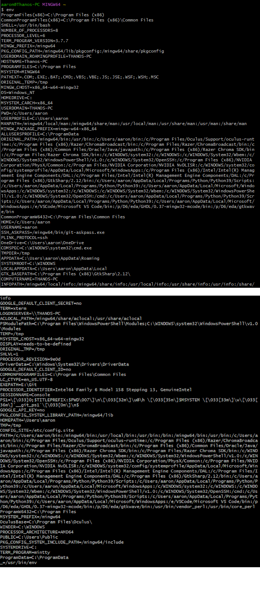

## ps
Gives info about processes currently running on device\
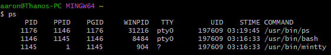

## pwd
Gives currently accessed path\
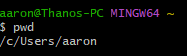

## git clone
Copies the referred repository, in this case, Kevin Lu's 'iot' repository\
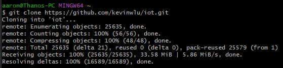

## cd iot
Sets current path to whatever is referred to, in this case, the 'iot' folder\
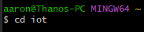

## ls
Shows files in current directory\
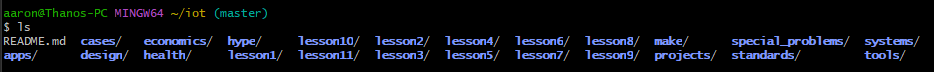

## cd
Cd by itself will return you to the original start of the path\
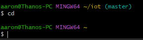

## df
Shows free space in the device\
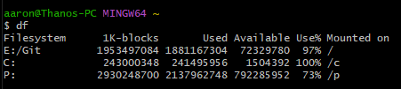

## mkdir demo/cd demo
Creates a new folder in your current path named whatever you refer it to, in this case 'demo'\
As previously mentioned, cd will access the folder mentioned, in this case, 'demo'\
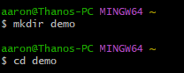

## nano file
Creates a file called with a given name, in this case, 'file' which can then be edited\
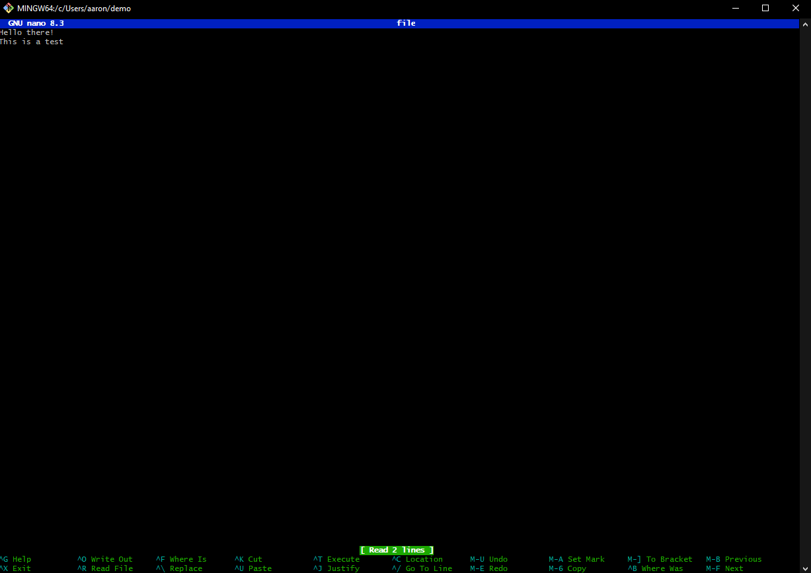

## cat file
Displays the named file\
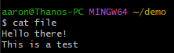

## cp/mv
cp copies a named file and then gives the copy a new name\
mv changes the name of a given file; after this instance, 'file' no longer exists\
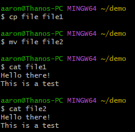

## rm
Deletes (removes) a given file\
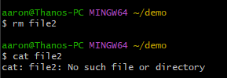

## clear
Very simply, clears the contents of the command line\
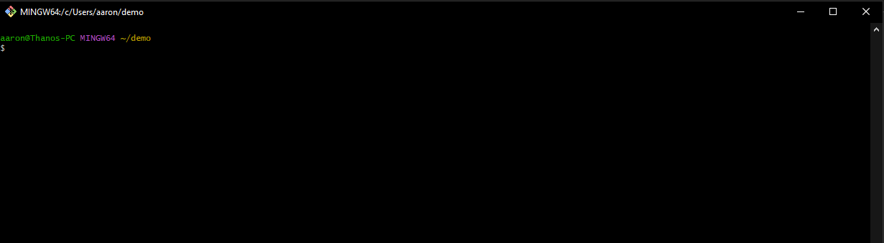

## man uname
Prints certian system information. Linunx only.\
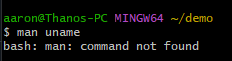

## uname -a
Prints certain system information\
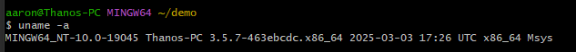

## ifconfig
Displays network interface info. Linux only.\
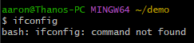

## ping localhost
Sends packets to a named device to test the network, in this case, 'localhost' which is this system\
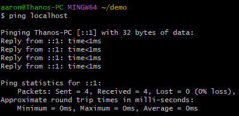

## netstat
Gives information about devices in your network connection\
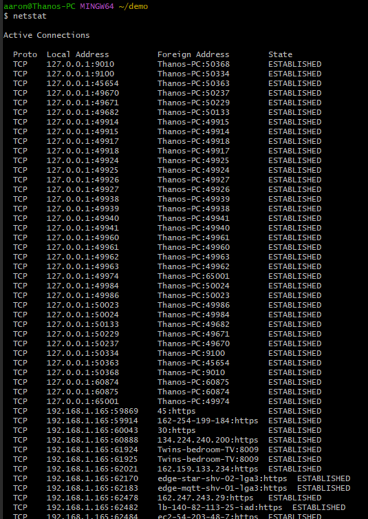
