# Lab 3 - Python
---

-Once again used Git Bash as preferred command line\
-Replaced all instances of 'python3' with just 'python' due to having an earlier version

Started off by installing recommended libraries\

## cd ~/iot and cd *3
Simply moves within the 'iot' folder followed by the '3' folder, both of which were previously downlaoded\

## julian.py
Gives the date, Julian date, and modified Julian date\

## date_example.py
Gives various forms of today's date and uses the numbers to calculate how long until a certain event\
_*As you can see, I finished this lab only a couple days before the last day of school_\
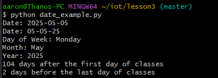

## datetime_example.py
Gives the exact date and time down to micro seconds multiple times over a short period\
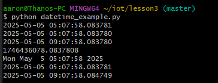

## time_example.py
Gives the current date and time over intervals of 10 seconds\
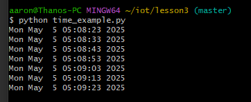

## sun.py "New York"
Was missing the 'pytz' library\
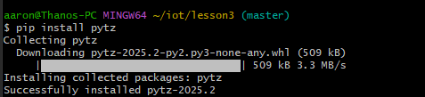

Prints the timezone and coordinates of the location given as well as times for specific phases of the sun\
In this example, New York was chosen\
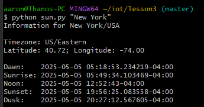

## moon.py
Gives the moon phases for each day for the next month\
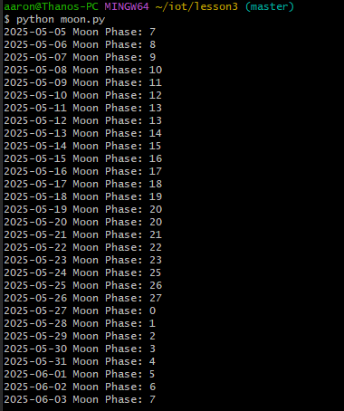

## coordinates.py "Samuel C. Williams Library"
Gives the coordinates of the given location, in this case, the local library on Stevens campus\
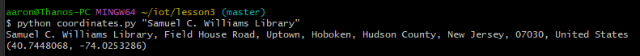

## address.py "40.74480675, -74.02532861159351"
Finds and gives the address at the given coordinates, in this case, it was the library as mentioned in the last part\
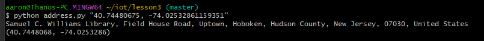

## cpu.py
Was missing the 'psutil' library\
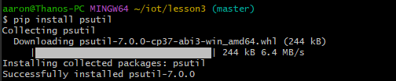

Gives the number of cores and threads in your device as well as their utilization rates\
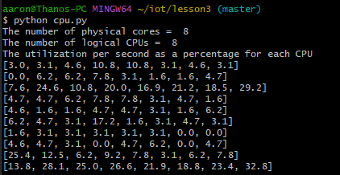

## battery.py
Gives the current battery percentage of your system, mine displays as 'none' since I am using a desktop\
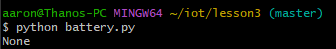

## documentstats.py document.txt
Gives the word count and top 10 words along with their number of uses for a text document\
The Declaration of Independence was used for this specific example\
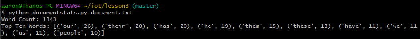

-As I worked through these labs I was reminded how anyone can make a program do cool things. I was impressed with all of the scripts that were being run despite being so simple.
