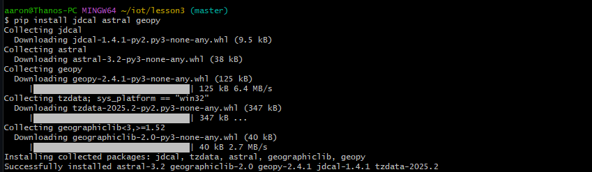
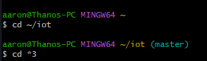
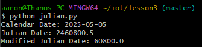

# Lab 3 - Python
---

-Once again used Git Bash as preferred command line\
-Replaced all instances of 'python3' with just 'python' due to having an earlier version

Started off by installing recommended libraries\

## cd ~/iot and cd *3
Simply moves within the 'iot' folder followed by the '3' folder, both of which were previously downlaoded\

## julian.py
---\

-As I worked through these labs I was reminded how anyone can make a program do cool things. I was impressed with all of the scripts that were being run despite being so simple.
