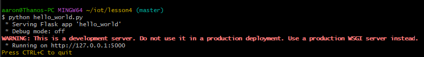

# Lab 4 - Django and Flask
---

_Disclaimers_\
-This lab took a lot of effort. There were many problems I encountered along the way that I had to thoroughly think through and solve.\
-Once everything worked properly, it was very satisfying considering the work put in\
-I lost many screenshots due to a computer error so I am replacing many of them with text\
\
-Continued to use Git Bash\
-Started off by installing Django and Django REST framework using these commands

```
$ pip -V
$ pip list
$ pip install -U setuptools
$ pip install -U django
$ pip install -U djangorestframework
$ pip install -U django-filter
$ pip install -U markdown
$ pip install -U requests
```

## Django Project "Stevens"

Start a Django project
```
$ django-admin startproject stevens
$ cd stevens
$ ls
manage.py  stevens
```

Editing settings.py in ~/stevens/stevens
```
$ cd stevens
$ ls
asgi.py  __init__.py  __pycache__  settings.py  urls.py  wsgi.py
$ nano settings.py
```


Copying .py files and .html
```
$ cp ~/iot/lesson4/stevens/urls.py .
$ cd ..
```
```
$ cd myapp
$ ls
admin.py  apps.py  __init__.py  migrations  models.py  tests.py  views.py
$ cp ~/iot/lesson4/stevens/admin.py .
$ cp ~/iot/lesson4/stevens/models.py .
$ cp ~/iot/lesson4/stevens/views.py .
```
```
$ mkdir static templates
$ cd templates
$ mkdir myapp
$ cd myapp
$ cp ~/iot/lesson4/stevens/index.html .
```

Inserting API key from google maps\
-I had some trouble getting this to work at first. I had ended up needing to copy and paste the key verbatim into Git Bash which was slightly difficult due to the UI.\


Copying static files
```
$ cd ~/stevens/myapp/static
$ cp ~/iot/lesson4/static/favicon.ico .
$ mkdir myapp
$ cd myapp
$ cp ~/iot/lesson4/static/*css .
$ cp ~/iot/lesson4/static/*js .
$ cd ~/stevens
```

Creating a user
-This will be the login used on the web-browser app
```
$ python manage.py makemigrations myapp
$ python manage.py migrate
$ python manage.py createsuperuser
Username (leave blank to use 'aaron'):
Email address: MY_EMAIL
Password: MY_PASSWORD
Password (again): MY_PASSWORD
Superuser created successfully.
```

Run Django server
```
$ python manage.py runserver
```
\

Opened at http://127.0.0.1:8000/admin \
Django home screen\

Inserting data\
\
Opened at http://127.0.0.1:8000 \
Weather station\


## Django Project "MyCPU"
-Many of the steps were similar from the last project
Start as Django project
```
$ django-admin startproject mycpu
$ cd mycpu
$ ls
manage.py  mycpu/
```

Start a Django app
```
$ python manage.py startapp myapp
$ ls
manage.py  myapp/  mycpu/
```

Editing settings.py in ~/mycpu/mycpu
```
$ cd mycpu
$ ls
asgi.py  __init__.py  __pycache__  settings.py  urls.py  wsgi.py
$ nano settings.py
```


Copying .py files
```
$ cp ~/iot/lesson4/mycpu/urls.py .
$ cd ..
```
```
$ cd myapp
$ ls
admin.py  apps.py  __init__.py  migrations  models.py  tests.py  views.py
$ cp ~/iot/lesson4/mycpu/admin.py .
$ cp ~/iot/lesson4/mycpu/models.py .
$ cp ~/iot/lesson4/mycpu/views.py .
$ cp ~/iot/lesson4/mycpu/serializers.py .
```

Changing default password\
-This step gave me a lot of trouble at first. I did not know what to change the fields to at first. I did some troubleshooting and found that they needed to be the username and password you had chosen for the user.
```
$ nano views.py
```

Copy index.html
```
$ mkdir static templates
$ cd templates
$ mkdir myapp
$ cd myapp
$ cp ~/iot/lesson4/mycpu/index.html .
```
Inserting API key from google maps\
-This step was identical to the stevens project
```
$ nano index.html
```


Copy static files
```
$ cd ~/mycpu/myapp/static
$ cp ~/iot/lesson4/static/favicon.ico .
$ mkdir myapp
$ cd myapp
$ cp ~/iot/lesson4/static/*css .
$ cp ~/iot/lesson4/static/*js .
$ cd ~/mycpu
```

Copy controller.py to ~/mycpu
```
$ ls
manage.py  myapp/  mycpu/
$ cp ~/iot/lesson4/mycpu/controller.py .
```

Change password in controller.py
```
$ nano controller.py
```


Install psutil\
-This was already installed for me, so the command was unnecessary for me
```
$ pip install -U psutil
```

Create a user
```
$ python manage.py makemigrations myapp
$ python manage.py migrate
$ python manage.py createsuperuser
Username (leave blank to use '_'): admin
Email address: MY_EMAIL
Password: MY_PASSWORD
Password (again): MY_PASSWORD
Bypass password validation and create user anyway? [y/N]: y
Superuser created successfully.
```

Run Django server
```
$ python manage.py runserver
```


Opened at http://127.0.0.1:8000/admin \
\
Inserting Data\
\

Posted data at the following links:\
-2024 to the Dt List at http://127.0.0.1:8000/dt \
-20 to the Cpu List at http://127.0.0.1:8000/cpu \
-20 to the Mem List at http://127.0.0.1:8000/mem \
\
\


Running native controller on another terminal\


Opened at http://127.0.0.1:8000/home \


## Flask
Installing Flask


Running hello_world.py in Python\
\
Running hello_world.py using Flask\

