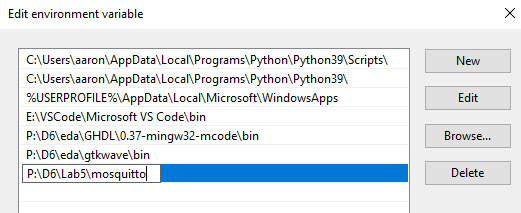
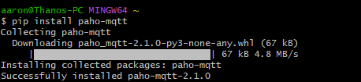
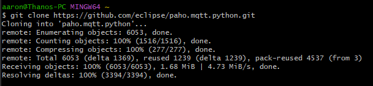
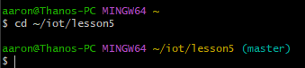
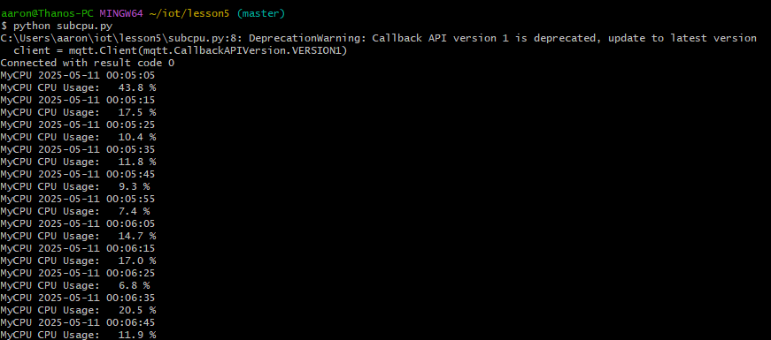
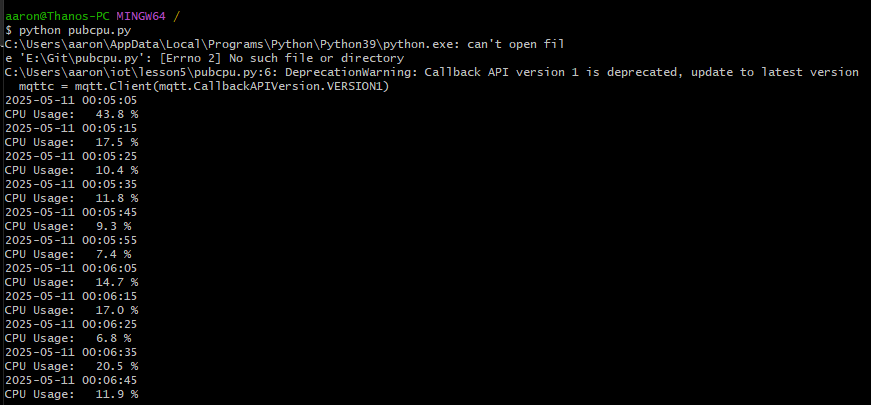

## Lab 5 - Paho-MQTT
---

-Continued to use Git Bash

## Editing Environment Variables

## Installing Paho

## Updating Repository

Make sure to change directory for _both_ terminals\

## python subcpu.py on one terminal

## python pubcpu.py on another terminal

