# Lab 6 - Node.js and Pystache
---

-Continued to use Git Bash

# Node.js

Started off by installing Schniz
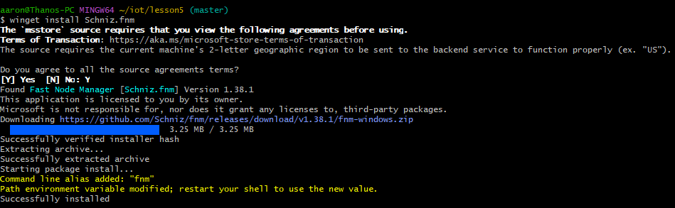

## Installing Node.js
Software\
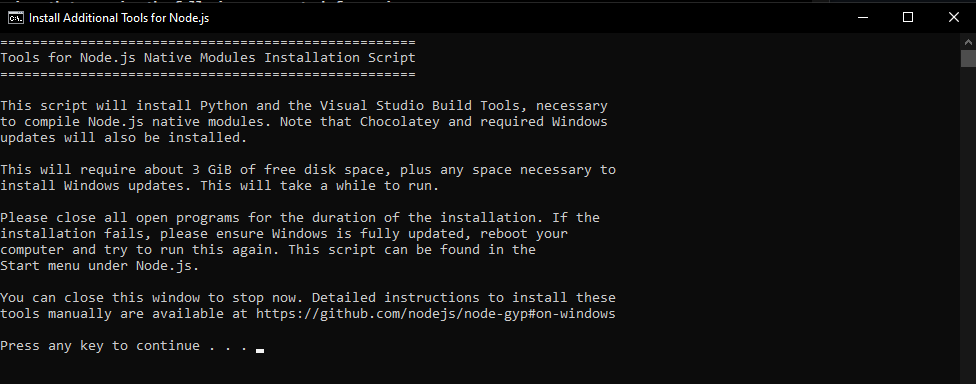
Terminal\
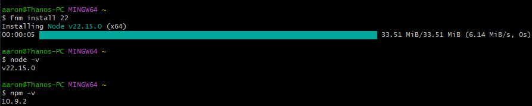

## node -h
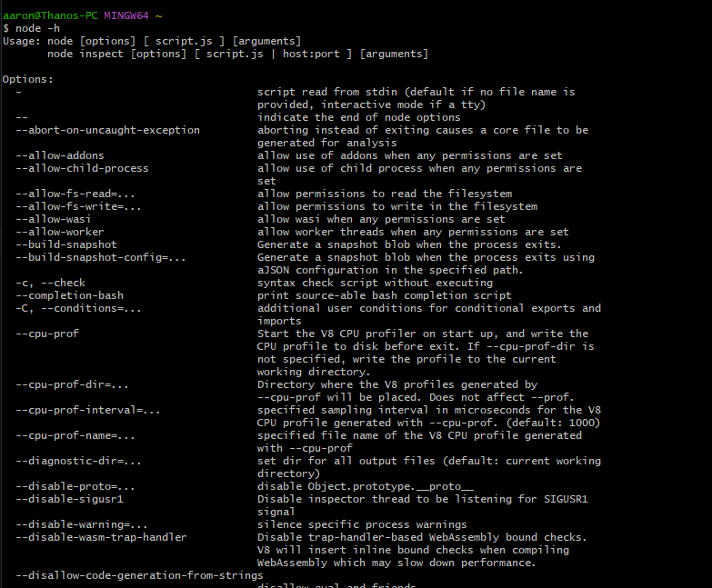

## hello-world.js
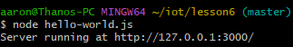\
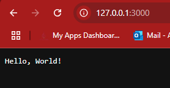

## hello.js
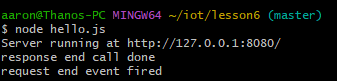\
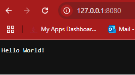

## http.js
Adds 1 to the counter every time you refresh the page\
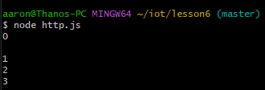\
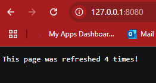

# Pystache

## Installing Pystache
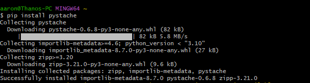

## say_hello.py
Running say_hello.py using say_hello.mustache and Pystache\
Then compared to say_hello.py using just Python\
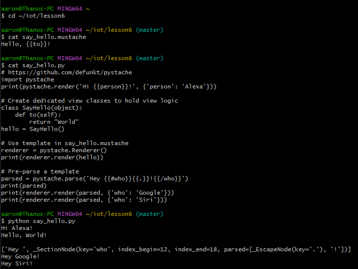
