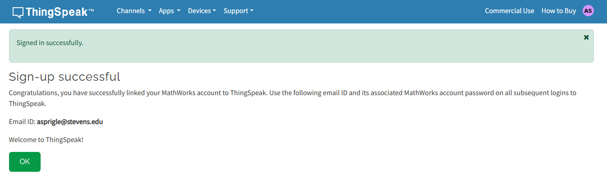
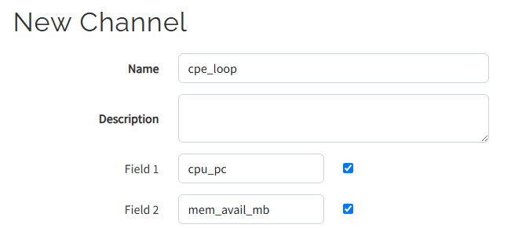
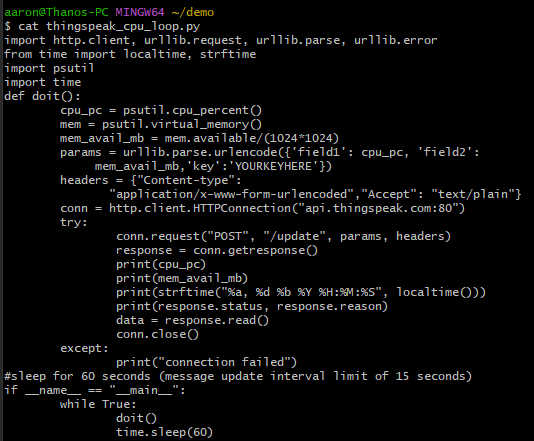
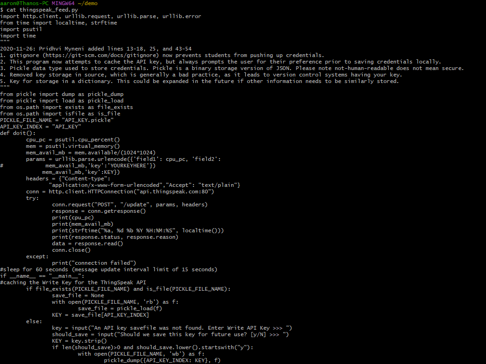

# Lab 7 - ThingSpeak and Google Sheets
---

-Continued to use Git Bash

## ThingSpeak

Signed up for MathWorks ThingSpeak\


Created new channel\
\

Copying .py files\
-psutil was already installed, so the first command was unnecessary
```
$ pip install -U psutil
$ cd ~/demo
$ cp ~/iot/lesson7/thingspeak_cpu_loop.py .
$ cp ~/iot/lesson7/thingspeak_feed.py .
```

Cat-ing thingspeak_cpu_loop.py and thingspeak_feed.py\
\



## Google Sheets
