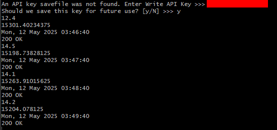
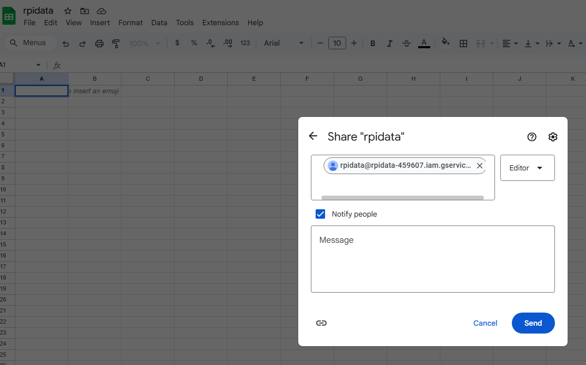

# Lab 7 - ThingSpeak and Google Sheets
---

-Continued to use Git Bash

## ThingSpeak

Signed up for MathWorks ThingSpeak\


Created new channel\
\

Copying .py files to ~/demo\
-psutil was already installed, so the first command was unnecessary
```
$ pip install -U psutil
$ cd ~/demo
$ cp ~/iot/lesson7/thingspeak_cpu_loop.py .
$ cp ~/iot/lesson7/thingspeak_feed.py .
```

Cat-ing thingspeak_cpu_loop.py and thingspeak_feed.py\
\


Inserting Write API key from ThingSpeak\


ThingSpeak channel stats\


## Google Sheets

Creating a new project in Google IAM\


Enabling Drive and Sheets API\


Creating credentials (service account)\
-A slightly different and updated method than the one listed on the lesson7 page was needed\


Installing gspread and oauth2client\
```
$ pip install -U gspread oauth2client
```


Copying .py files to ~/demo
```
$ cd demo
$ cp ~/iot/lesson3/system_info.py .
$ cp ~/iot/lesson7/rpi_spreadsheet.py .
```

Manually moving .json file to 'demo' folder\
-Due to the lab normally being done on a Raspberry Pi, I had to improvise a bit for this step\


Sharing spreadsheet with client_email\


Editing rpi_spreadsheet.py\


Running rpi_spreadsheet.py (attempt 1 - error)\
-Once again, not having the proper Pi hardware caused some roadblocks. I ended up having to edit the code in system_info.py


