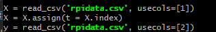
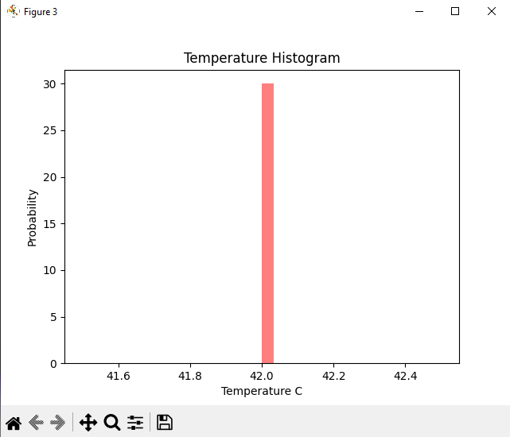

# Lab 8 - Data Analysis
---

-Continued using Git Bash

Installing python packages
```
$ pip install numpy scipy scikit-learn matplotlib pandas tensorflow keras
```

Example testing\


Copying/editing .py files\
-This was a multi-step process. I had to properly label each column in the sheet, download it as a CSV, manually move it to the demo folder, and edit the python files to properly read it.
```
$ cd ~/demo
$ cp ~/iot/lesson8/plt_final.py .
$ cp ~/iot/lesson8/plt_cv2.py .
$ nano plt_final.py
$ nano plt_cv2.py
```
\
\


-The 'Temperature C' data did not change, it stayed consistently at 42. This may be why the charts seem flat or interesting.

Google charts\


### plt_final.py





### plt_cv2.py
-This first chart is the predicted temperature in C from the data given. Since it stayed consistent, it makes sense that there is only 1 possibility.\


-This second chart, although not necessary for the lab, is the predicted CPU usage. I included it since it was more interesting and better showed the program's capabilities.\

